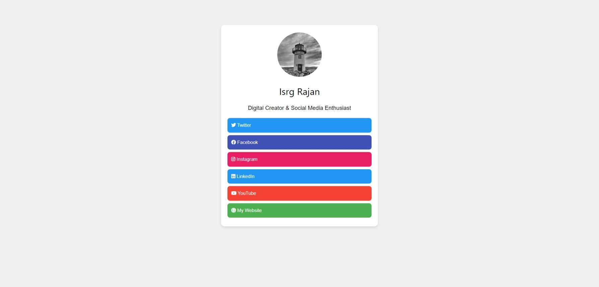
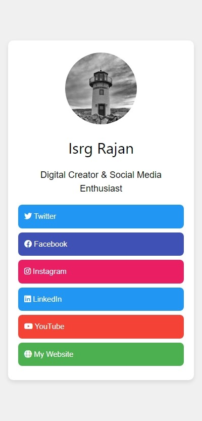

# W3.CSS Social Profile

A simple, responsive social profile landing page built using **W3.CSS** and **FontAwesome**.  
This page serves as a personal **landing page** where users can showcase their social media links, website, and bio in one place.

## 📸 Screenshots

### Desktop View


### Mobile View


## 🔥 Features

- ✅ **Minimal & Responsive** – Built using W3.CSS for a clean and modern design.  
- 🎨 **Customizable** – Easily modify colors, fonts, and links to match your branding.  
- 🔗 **Social Links** – Add links to your social media and personal website.  
- 📱 **Mobile Friendly** – Works perfectly on all screen sizes.  
- 📊 **SEO Ready** – Includes meta tags for better search visibility.  
- 🚀 **Fast Loading** – No external dependencies except W3.CSS & FontAwesome.  

## 🚀 Live Demo

[Click here to view the live demo](https://isrgrajan.github.io/W3.CSS-Social-Profile/)

## 📥 Installation

To use this template, follow these steps:

1. **Clone the Repository**
   ```sh
   git clone https://github.com/isrgrajan/W3.CSS-Social-Profile.git
   cd W3.CSS-Social-Profile
   ```

2. **Open `index.html` in your browser**  
   Just double-click on `index.html` or open it with a local web server.

## 🔧 Customization

- Change the profile picture by replacing the placeholder image in `index.html`.
- Edit the links inside `index.html` to match your social profiles.
- Modify colors and styles inside the `<style>` section.

## 📝 License

This project is licensed under the **MIT License**.  
You are free to use, modify, and distribute it without restrictions.

---

💡 **Feel free to contribute and improve this project!** 🚀
